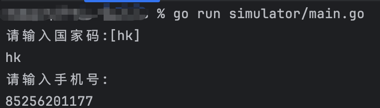

# WhatsApp 注册协议

开源WhatsApp个人版注册协议的go语言实现，学习练手用，切记请勿非法使用！

openws实现了iOS下个人版，商业版WhatsApp协议。

平台：iOS 
版本：个人版 Messenger 
Go版本：1.18以上 

* 功能测试 
**go run simulator/main.go**

* 技术交流 

微信技术交流群，2群，添加微信号@guduai-dajiang为好友，拉你进群。 
