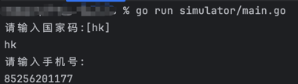

# WhatsApp 注册协议

openws实现了iOS WhatsApp 个人版，商业版的注册协议，仅学习练手用，切记请勿非法使用！


平台：iOS 

版本：个人版 Messenger 

Go版本：1.18以上 


# 功能测试 
```shell
go run simulator/main.go
```
****

效果图：



# 技术交流 

* 微信技术交流群，2群，添加微信号@guduai-dajiang为好友，拉你进群。


* 微信公众号

&nbsp;&nbsp;&nbsp;&nbsp;&nbsp;&nbsp;
